# Regtech Guide Theme Relationships - Mermaid Flow Diagram

```mermaid
graph TB
    %% Core Regulatory Foundation
    RC[Regulatory Compliance & Frameworks] --> TC[Technology Architecture & Patterns]
    RC --> RM[Risk Management & Governance]
    RC --> DM[Data Management & Privacy]
    
    %% Technology Architecture Connections
    TC --> DM
    TC --> OE[Operational Excellence & Monitoring]
    TC --> AI[AI/ML & Emerging Technologies]
    
    %% Data Management Connections
    DM --> OE
    DM --> AI
    DM --> RC
    
    %% Risk Management Connections
    RM --> OE
    RM --> BV[Business Value & Implementation]
    RM --> AI
    
    %% Operational Excellence Connections
    OE --> BV
    OE --> AI
    
    %% AI/ML Connections
    AI --> BV
    AI --> RC
    
    %% Business Value Connections
    BV --> RC
    BV --> TC
    
    %% Specific Theme Details
    subgraph "Regulatory Compliance & Frameworks"
        RC1[Multi-jurisdictional Compliance]
        RC2[Regulatory Evolution]
        RC3[Compliance Architecture]
        RC4[Sector-specific Frameworks]
    end
    
    subgraph "Technology Architecture & Patterns"
        TC1[Event-driven Architecture]
        TC2[Microservices Patterns]
        TC3[Cloud-native Compliance]
        TC4[Data Governance Patterns]
    end
    
    subgraph "Data Management & Privacy"
        DM1[Data Lineage Tracking]
        DM2[Privacy by Design]
        DM3[Data Protection]
        DM4[Audit Trails]
    end
    
    subgraph "Risk Management & Governance"
        RM1[Operational Risk]
        RM2[Vendor Risk]
        RM3[Regulatory Risk]
        RM4[AI Governance]
    end
    
    subgraph "Operational Excellence & Monitoring"
        OE1[SRE Practices]
        OE2[Incident Response]
        OE3[Change Management]
        OE4[Observability]
    end
    
    subgraph "AI/ML & Emerging Technologies"
        AI1[Explainable AI]
        AI2[Predictive Compliance]
        AI3[Algorithmic Accountability]
        AI4[Real-time Intelligence]
    end
    
    subgraph "Business Value & Implementation"
        BV1[ROI and Cost-benefit]
        BV2[Implementation Strategies]
        BV3[Vendor Management]
        BV4[Cost Overruns]
    end
    
    %% High-Overlap Connections (Dashed Lines)
    DM1 -.-> DM4
    TC1 -.-> DM4
    RM1 -.-> OE3
    AI1 -.-> RM4
    BV2 -.-> RM3
    
    %% Cross-Chapter Theme Repetition (Dotted Lines)
    RC -.-> TC
    RC -.-> DM
    RC -.-> RM
    DM -.-> AI
    OE -.-> RM
    
    %% Styling
    classDef coreTheme fill:#e1f5fe,stroke:#01579b,stroke-width:3px
    classDef subTheme fill:#f3e5f5,stroke:#4a148c,stroke-width:2px
    classDef overlap fill:#fff3e0,stroke:#e65100,stroke-width:2px,stroke-dasharray: 5 5
    
    class RC,TC,RM,DM,OE,AI,BV coreTheme
    class RC1,RC2,RC3,RC4,TC1,TC2,TC3,TC4,DM1,DM2,DM3,DM4,RM1,RM2,RM3,RM4,OE1,OE2,OE3,OE4,AI1,AI2,AI3,AI4,BV1,BV2,BV3,BV4 subTheme
```

## Theme Relationship Analysis

### Primary Dependencies (Solid Lines)
1. **Regulatory Compliance** is the foundational theme that influences all others
2. **Technology Architecture** enables implementation of regulatory requirements
3. **Data Management** is critical for both compliance and operational excellence
4. **Risk Management** connects business value with operational requirements
5. **AI/ML** represents the future direction but must maintain regulatory compliance

### High Overlap Areas (Dashed Lines)
1. **Data Lineage ↔ Audit Trails**: Both require comprehensive tracking
2. **Event-driven Architecture ↔ Audit Trails**: Natural audit trail generation
3. **Operational Risk ↔ Change Management**: Risk management through controlled changes
4. **Explainable AI ↔ AI Governance**: Transparency requirements for AI systems
5. **Implementation Strategies ↔ Regulatory Risk**: Risk-aware implementation approaches

### Cross-Chapter Repetition (Dotted Lines)
1. **Regulatory Compliance** appears as a core theme in all chapters
2. **Data Management** concepts are repeated across multiple chapters
3. **Risk Management** principles apply to all regtech implementations
4. **AI/ML** challenges are discussed in multiple contexts
5. **Operational Excellence** is essential for all production systems

## Key Insights

### 1. **Regulatory Compliance as Central Hub**
- All themes connect back to regulatory compliance
- This reflects the fundamental nature of regtech as compliance-enabling technology

### 2. **Technology-Data-Operations Triangle**
- Strong interconnections between technology architecture, data management, and operational excellence
- These three themes form the operational foundation of regtech systems

### 3. **AI/ML as Future Direction**
- AI/ML connects to all other themes but requires careful integration
- Represents both opportunity and risk in regtech evolution

### 4. **Business Value as Outcome**
- Business value depends on successful implementation of all other themes
- Risk management is critical for achieving sustainable business value

### 5. **High Overlap Areas Need Consolidation**
- Several themes have significant overlap that could be consolidated
- This suggests opportunities for content optimization and clearer chapter boundaries
